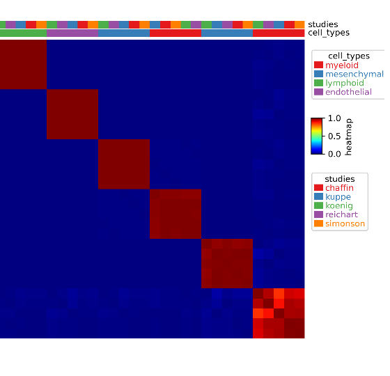
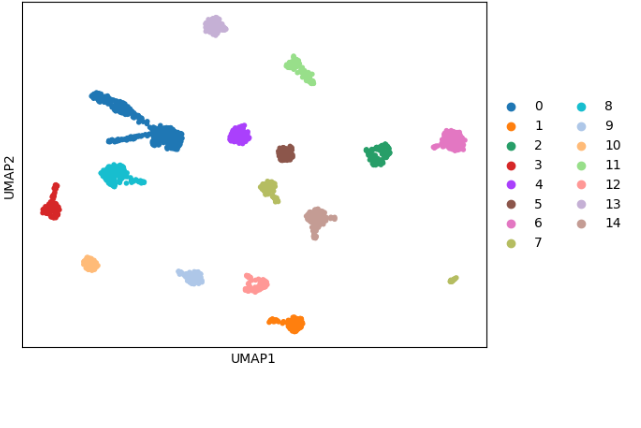
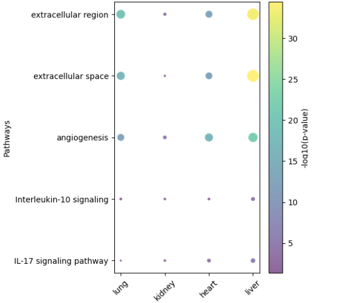
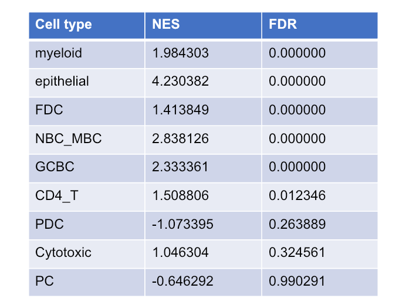
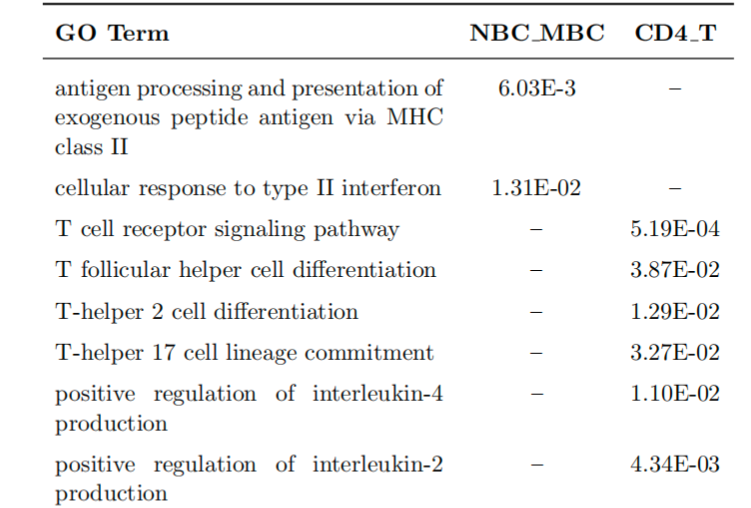
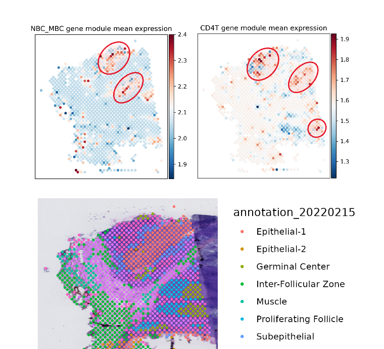
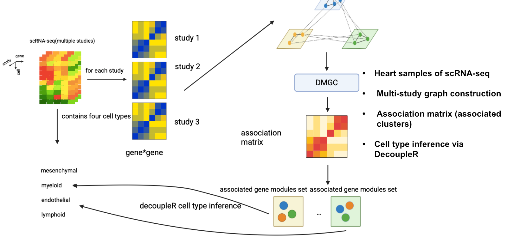
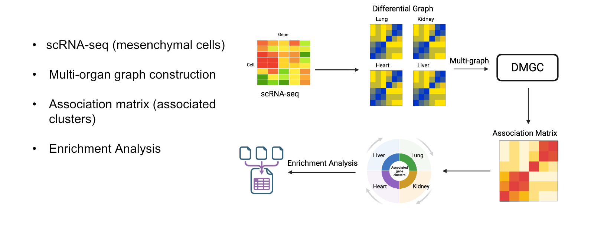
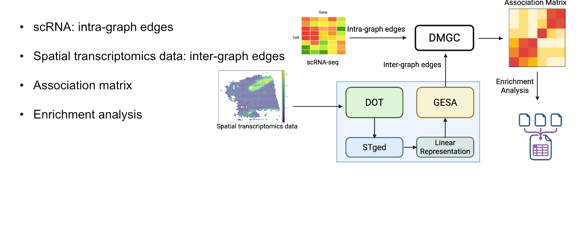

# Deep Multi-Graph Clustering

## Molecular and cellular interactions in disease

### 1. Validation across five heart scRNA-seq studies

DMGC recovers aligned cross-study cluster blocks that correspond to lymphoid, myeloid, mesenchymal, and endothelial identities.

  

### 2. Shared gene modules across organs

Mesenchymal-cell modules are separated in lung and show associations across lung, kidney, heart, and liver.

  

Shared modules show enrichment for extracellular-region programs, angiogenesis, and IL-10/IL-17 signaling.

  

### 3. Spatial tonsil interaction

Cell-type GSEA identifies significant enrichment for both NBC_MBC (NES 2.84, FDR 0.00) and CD4_T (NES 1.51, FDR 0.012).

  

The NBC_MBC–CD4 T-cell association is enriched for MHC-II antigen presentation, T-cell receptor signaling, and T-follicular-helper differentiation.

  

Candidate co-occurring regions are visible in the spatial transcriptomics tissue map.

  

## Analysis workflows

  

  

  

[Complete presentation](results/presentation_final.pptx)
